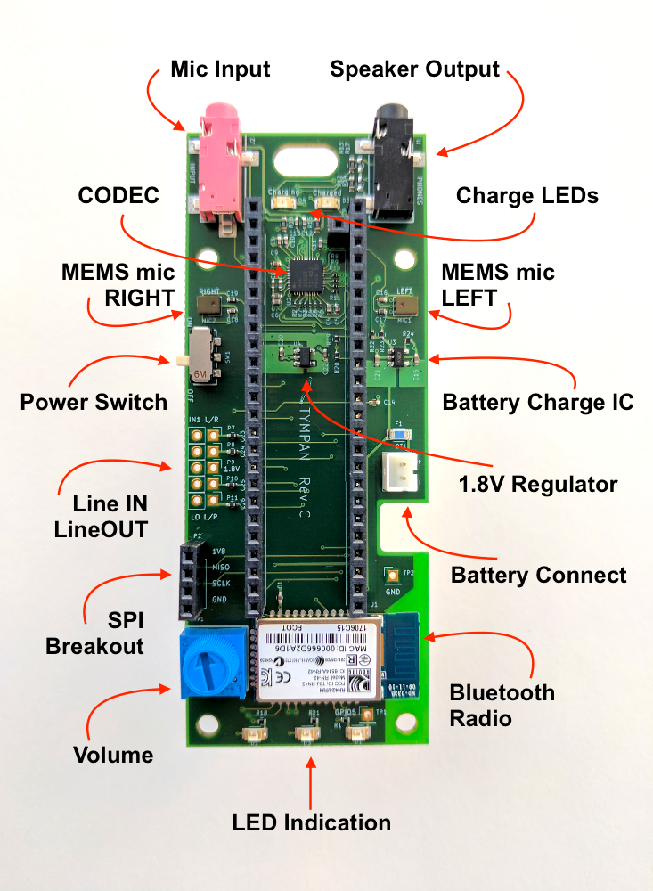
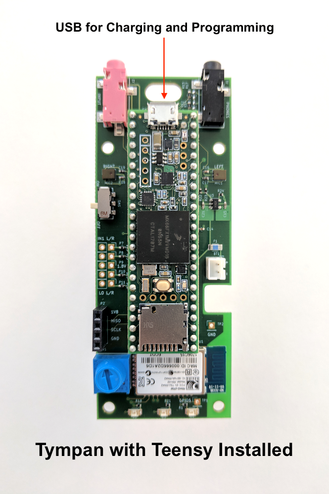

# Tympan Hardware Overview
## Tympan Audio Board RevC

## Tympan assembled with Teensy 3.6

## Hardware Modifications 

The Tympan RevC is Open Source Hardware, and that means that you can hack it or mod it and we will be here to help! There are a couple of possible mods that are baked into the hardware.

### Mic Input Jack

The MIC input jack is the pink one. The way that it has been wired to the CODEC causes the following things to happen when you plug into it:

* Mono consumer MIC (one element), you get mono into Tympan
* Stereo consumer MIC (two elements), you get mono (just the left mic is active)
* Hearing-Aid MIC (one element), you get mono into Tympan
* Stereo line-in, you get stereo into Tympan

It is possible to modify the hardware to change the MIC Input Jack behavior. If you add a 2.2K Resistor to the unpopulated R16 position, you will change the MIC input behavior to:

* Mono consumer mic (one element), you get mono into Tympan
* Stereo consumer mic (two elements), you get stereo
* Hearing-Aid Mic (one element), you get nothing
* Stereo line-in, you get nothing

### Line IN / OUT

We have broken out the `IN1` RIGHT and LEFT channels for your use. Also, the CODEC has a Line OUT channel which is also broken out. The pins available are laid out in standard 0.1" pitch, and can be soldered to as you see fit. We also breakout the 1.8V power line between them for your use a a bias voltage. You're welcome ;) 

