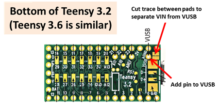

# Tympan_Rev_C_Hardware
Repository for the board files for Tympan Rev C

These deisgn files were made with [KiCAD](http://kicad-pcb.org/) PCB capture software. The custom component files for parts used in this design are loced in the repo as well. Everything should render correctly in the Schematic and the PCB. If not, you may need to adjust the library paths. 

This work is based on work done by Creare and their team in Spring of 2017. Modifications have been made to their Rev A hardware design to overcome bugs and improve the design. 

## Works with Teensy 3.6
The [Teensy 3.6](https://www.pjrc.com/store/teensy36.html) from PJRC is the 'brain' that drives our audio board. In order to make the Tympan and the Teensy live happily together, you will need to modify the Teensy board as shown.

The change allows us to use the VUSB (5V) to charge the LiIon battery with circuitry on the Tympan. That's it! Follow the [getting started guide](https://www.pjrc.com/teensy/first_use.html) for the Teensy, and then you will be up and running with our [Tympan Library](https://github.com/Tympan/Tympan_Library) for Arduino!

## Enclosure
The Tympan Case is 3D printed, and the design files can be found [here](https://github.com/Tympan/Tympan_Rev_C_Hardware/tree/master/Enclosure) There is also a Bill of Materials that will list the screws and threaded inserts that we used. 

